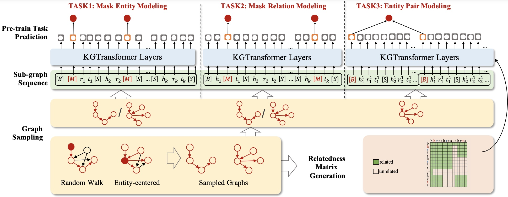
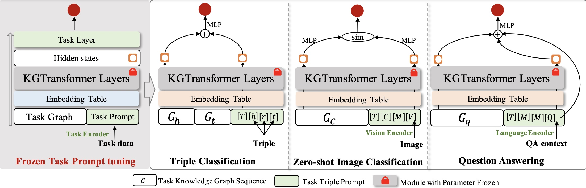

# KGTransformer
Code and datasets for paper "Structure Pre-training and Prompt Tuning for Knowledge Graph Transfer".

## Model Architecture

### Subgraph Pre-training
<div align=center>

</div>

### Task prompt tuning
<div align=center>

</div>

## Requirements
Run the following commands to create an environment (assuming CUDA10.1):

(pytorch:1.8PAI-gpu-py36-cu101-ubuntu18.04)
```
pip install torch==1.8.0+cu101 -f https://download.pytorch.org/whl/torch_stable.html
pip install transformers==2.0.0
pip install tokenizers==0.11.1
pip install scipy==1.5.3
pip install scikit-learn==0.24.2
pip install packaging==21.3
pip install huggingface_hub==0.4.0
```

## How to Run
### Pretrain
```
python run_pretrain.py --pretrain_dataset BIG --dataset_name BIG --num_hidden_layers 4 --train_bs 16 --lr 1e-4 --epochs 10 
```

### Downstream Task: Triple Classification
```
python run_down_triplecls.py --dataset_name WN18RR --pretrain_dataset BIG --down_task down_triplecls --train_bs 16 --test_bs 128 --epochs 50 --fixedT 1
```
### Downstream Task: Zero-shot Image Classification
```
python run_down_zsl.py --dataset_name down_zsl --pretrain_dataset down_zsl --down_task down_zsl --train_bs 32 --test_bs 8 --epochs 10 --fixedT 1 --lr 1e-4 --test_epoch 1 --multi_pic 15
```
## Downstream Task: Question Answering 
```
pip install transformers==2.0.0
```

```
python run_down_qa.py --dataset_name down_qa --pretrain_dataset BIG --down_task down_qa --token_types 5 --train_bs 16 --big_bs 64 --train_split 1 --test_bs 64 --epochs 20 --encoder_lr 2e-5 --decoder_lr 1e-4 --fixedT 1 
```


